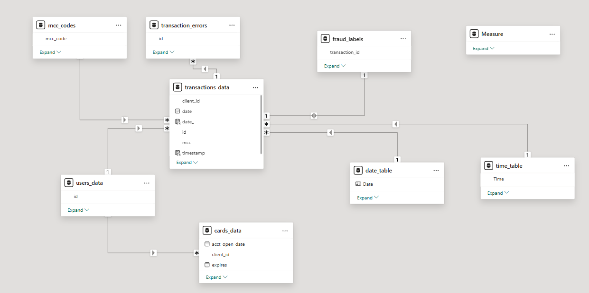
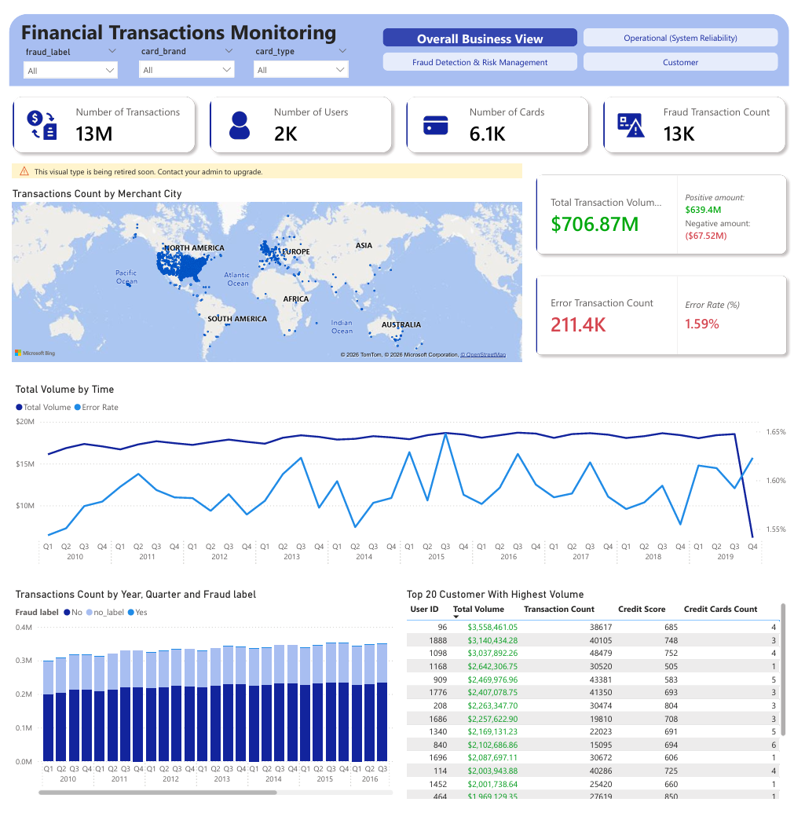
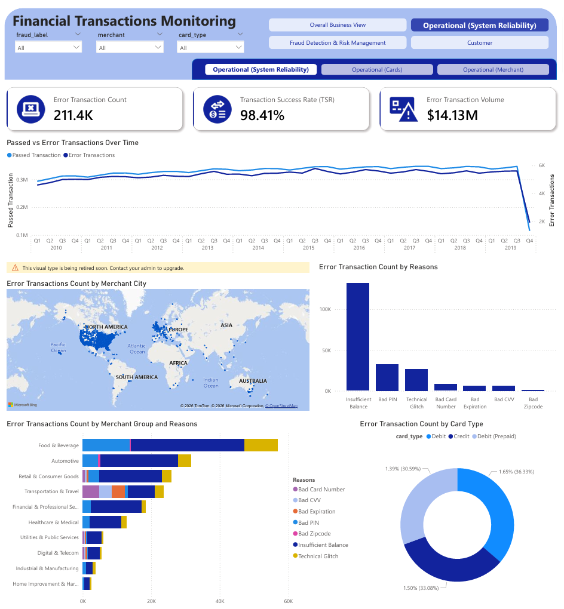
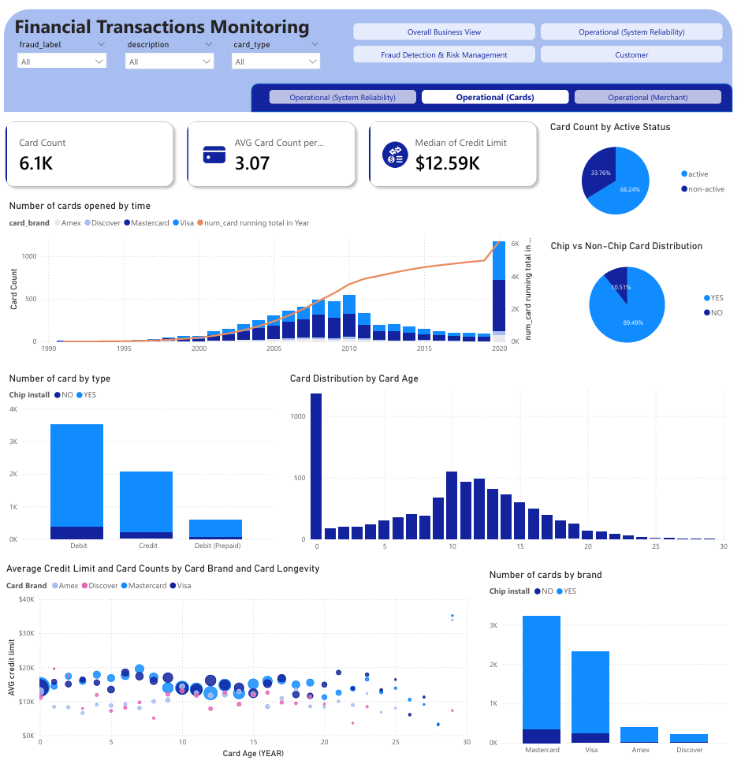
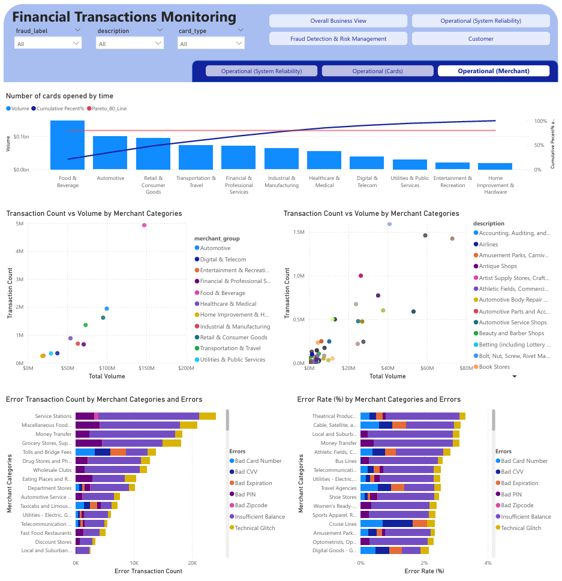
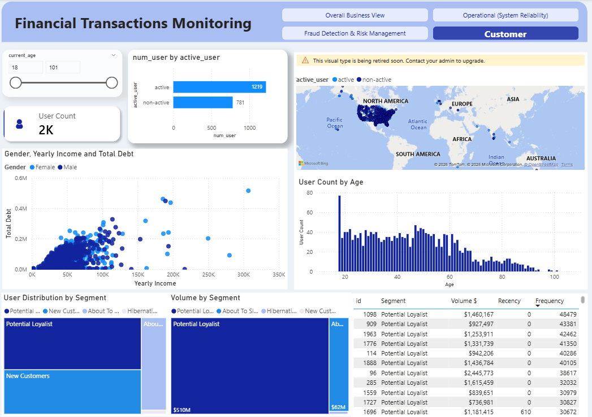
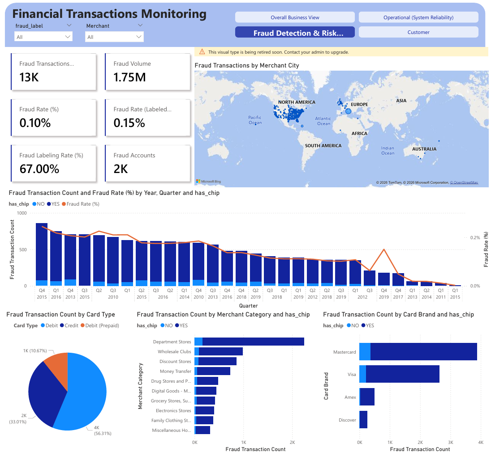

# 💹 Financial Transactions Analysis & Fraud Detection

**Author:** Nguyen Quoc Hoang Lan  
**Duration:** February 6, 2026 - Present  
**Tools:** Python, Power BI  
**Contact:** nqhl21354@gmail.com


# 📑 Table of Contents

- [🎯 Project Overview](#-project-overview)
- [💼 Business Problem & Project Objectives](#-business-problem--project-objectives)
- [📂 Dataset Description](#-dataset-description)
- [🚀 Project Workflow](#-project-workflow)
- [📊 Dashboard Strategy](#-dashboard-strategy)
    - [Overall Business Health](#1️⃣-overall-business-health)
    - [Operational Performance](#2️⃣-operational-performance)
    - [Customer Segmentation](#3️⃣-customer-segmentation)
    - [Fraud Detection & Risk Management](#4️⃣-fraud-detection--risk-management)
- [🔍 Key Business Conclusion](#-key-business-conclusion)
- [📈 Expected Business Impact](#-expected-business-impact)
- [🔮 Future Enhancements](#-future-enhancements)


## 🎯 Project Overview


This project analyzes 13M+ financial transactions to evaluate business performance, operational reliability, customer behavior, and fraud exposure. 

Using Python for data processing and Power BI for executive dashboards, the project transforms raw transactional data into strategic decision-support insights for financial institutions.

### 🛠️ Technical Stack Summary

| Component | Technology | Purpose |
|-----------|-----------|---------|
| Data Processing | Python (Pandas, NumPy) | Data cleaning, transformation, feature engineering |
| Visualization | Matplotlib, Seaborn | Exploratory analysis and pattern discovery |
| Business Intelligence | Power BI (DAX) | Interactive dashboards and executive reporting |
| Data Storage | CSV, JSON | Source data format |
| Development | Jupyter Notebook, VS Code | Analysis environment |

---

## 💼 Business Problem & Project Objectives
**💼 Business Problem**:
Modern financial institutions operate in a data-driven ecosystem where they face critical challenges:
1. **Fraud Prevention:** Real-time identification of suspicious transactions to minimize financial losses
2. **Customer Intelligence:** Transaction history analysis for user segmentation and spending behavior prediction to enhance marketing effectiveness
3. **Operational Excellence:** Performance monitoring and optimization across card types, merchants, and transaction channels


**🎯 Project Objectives**:
Build an intelligent Business Intelligence Dashboard that provides executives and managers with comprehensive view into the whole system health:
- **Strategic Insights:** Holistic views of business performance and trends
- **Operational Analytics:** Help monitoring of transaction systems and error patterns
- **Customer Intelligence:** Deep understanding of user segments and behavior
- **Risk Management:** Proactive fraud detection and security threat identification

---

## 📂 Dataset Description
- **Data Source:** [Financial Transactions Dataset – Analytics (Kaggle)](https://www.kaggle.com/datasets/computingvictor/transactions-fraud-datasets) 

This comprehensive financial dataset combines transaction records, customer information, and card data from a banking institution across the 2010s decade. The dataset consists of 5 primary components:

### 📊Data Relationships



### 1. **Transaction Data** (`transactions_data.csv`)
- **Size:** 13,305,915 rows; 12 columns
- **Description:** Detailed transaction records with timestamps, amounts, merchants, and error codes
- **Key Features:**
  - Transaction ID, date, time, and amount
  - Merchant information and category codes (MCC)
  - Error codes and transaction status
  - Card and user identifiers

### 2. **Card Information** (`cards_data.csv`)
- **Size:** 6,146 rows; 13 columns
- **Description:** Credit and debit card details linked to customer accounts
- **Key Features:**

### 3. **User Data** (`users_data.csv`)
- **Size:** 2,000 rows; 14 columns
- **Description:** Demographic and account information for customers
- **Key Features:**
  - Customer demographics
  - Account-level details
  - Credit scores and financial profiles

### 4. **Fraud Labels** (`train_fraud_labels.json`)
- **Size:** 8,914,963 rows; 2 columns
- **Description:** Binary classification labels for transaction fraud status
- **Format:** JSON with transaction ID mapped to fraud label (Yes/No)

### 5. **Merchant Category Codes** (`mcc_codes.json`)
- **Size:** 109 rows; 2 columns
- **Description:** Industry-standard classification codes for business types
- **Examples:**
  - 5812: Eating Places and Restaurants
  - 5541: Service Stations (Gas)
  - 5411: Grocery Stores, Supermarkets
  - 7996: Amusement Parks, Carnivals, Circuses


## 🚀 Project Workflow
This project was executed following a structured analytical pipeline, transforming raw transactional data (13M+ rows) into a scalable Business Intelligence system.

---

### **Phase 1: Data Engineering & Processing (Python)**

Large-scale preprocessing was performed to ensure data consistency, relational integrity, and analytical readiness before dashboard integration.

**Multi-Source Data Integration**
- Loaded structured (CSV) and semi-structured (JSON) datasets
- Converted fraud label JSON into relational format
- Standardized Merchant Category Code (MCC) lookup table
- Merged transaction, card, user, and fraud datasets

**Data Type Normalization & Financial Cleaning**
- Converted currency fields from string to numeric for accurate aggregation:
- Null Handling & Data Standardization
    - Replaced missing error values with "none"
    - Standardized missing ZIP codes to "Unknown"
    - Corrected inconsistent geographic entries (e.g., ONLINE merchants)

**Multi-Label Error Decomposition**
- Transaction errors contained comma-separated categories.
- Exploded them into atomic rows for accurate frequency analysis:


### **Phase 2: Exploratory Data Analysis (EDA)**
- Performed statistical and distributional analysis to uncover behavioral and operational patterns:
- Transaction volume distribution by card type and merchant category


### **Phase 3: Business Intelligence & Dashboard Architecture (Power BI)**
🏗️ 1️⃣ Data Modeling
- Implemented a Star Schema architecture:
- Fact Table: Transactions
- Dimension Tables: Users, Cards, MCC Codes, Fraud Labels
- One-to-many relationships
- Controlled filter propagation to maintain performance

🧮 2️⃣ Feature Engineering in Power BI
- Created calculated columns and derived fields (i.e. card_age, card_active, fraud_flag,...)
- Date & Time dimension tables

🧠 3️⃣ Advanced DAX Implementation
- Used dynamic measures (not static columns) for context-aware analytics.
- Running Contribution (Pareto-style calculation)
    ```DAX
    total_vol_running_merchant = 
    VAR total_vol = CALCULATE([total_vol], ALL(mcc_codes))
    VAR current_rank =
        RANKX(
            ALLSELECTED(mcc_codes[merchant_group]),
            [total_vol],
            ,
            DESC
        )
    RETURN
        CALCULATE(
            [total_vol] / total_vol,
            FILTER(
                ALLSELECTED(mcc_codes[merchant_group]),
                RANKX(
                    ALLSELECTED(mcc_codes[merchant_group]),
                    [total_vol],
                    ,
                    DESC
                ) <= current_rank
            )
        )
    ```
Purpose: Enabled cumulative contribution analysis (80/20 evaluation).


⏳ 4️⃣ Time Intelligence Implementation
- Created Date dimension table
- Implemented Year-over-Year comparison
- Enabled running totals & cumulative metrics

🎛️ 5️⃣ Interactive Dashboard Features
- Slicers & dynamic filtering
- Drill-through pages (merchant-level deep dive)
- Geographic fraud mapping
- Multi-layer KPI cards

---


## 📊 Dashboard Strategy

The project delivers a multi-faceted dashboard with four main analytical perspectives:

### 1️⃣ **Overall Business Health**

**Target Audience:** C-level executives, strategic decision-makers

**Insights Delivered:**
- Transaction volume and value trends
- Year-over-year growth comparisons
- Geographic transaction distribution


**Key Metrics (KPIs):**
- Transaction Count:
- Total Transaction Volume (TTV)
- Users Count
- User Growth Rate
- Error Rate (%)

### 📌 **Key finding:**
- **USA and Europe** dominate transaction density, reflecting core market strength.
- The transactions and volume remain stable over the year
- The error rate fluctuates slightly but remains low (1.55% - 1.65%)
- Fraud exposure exists but controlled

**The Dashboard**




---

### 2️⃣ **Operational Performance**

**Target Audience:** Operations managers, product managers, technical teams

**Insights Delivered:**
- How the system and company product perform
- Merchant categories performance
- System reliability and error hotspots

**Key Metrics:**

**⚠️ Error & System Reliability Metrics**
- Transaction Success Rate (TSR) (%)   
- Error Transaction Count
- Error Transaction Volume

**🪪 Card Performance Metrics**
- Card Count
- Avg Cards per User
- Median Credit Limit: Since the distribution of the credit limit is right-skewed, the median is a better metric than the mean.
- Active Rate
- Chip Adoption Status
- Card Age: This can be calculated by subtracting the card’s opened date (acct_open_date) from the latest date contained in the dataset (i.e., the most recent account opened date). The unit is in years.

**🏪 Merchant Performance Metrics**
- Merchant Transaction Share
- Merchant Volume Share
- Card volume by merchant category

### 📌 **Key finding:**
- **System Reliability**: High overall system reliability (TSR > 98%). The most common reason for errors is Insufficient Balance, rather than technical system failures.
- **Cards**:
    - Approximately two-thirds of the total opened cards are active, indicating healthy utilization.
    - Recently saw a surge in new card issuance.
    - The portfolio is currently debit-dominant, with strong chip adoption.
    - The card lifecycle suggests an optimal profitability window of 8–12 years.
- **Merchant**: 
    - The Food and Beverage group (including Eating Places and Restaurants, Fast Food Restaurants, and Drinking Places – Alcoholic Beverages) contributes the highest transaction volume (20.8%) and the highest number of transactions.
    - More specifically, "Grocery Stores and Supermarkets," "Miscellaneous Food Stores," and "Service Stations" can be targeted as top markets, as they lead in both transaction count and volume.
    - "Theatrical Producers" and "Cable and Satellite TV Services" require further investigation, as they have relatively low transaction volumes but rank among the top two highest error rates.
    - Additional investigation is recommended for categories where error patterns are not primarily driven by Insufficient Balance (e.g., "Cruise Lines," "Tolls and Bridge Fees").

**Dashboard**
- **Operational (System Reliability)**



- **Operational (Cards)**



- **Operational (Merchants)**



---

### 3️⃣ **Customer Segmentation**

**Target Audience:** Growth team

**Insights Delivered:**
- Overall customer demographic and activation profile
- Geographic distribution of active vs non-active users
- Income and debt segmentation patterns
- Customer concentration and lifecycle structure

**Key Metrics:**
- Total Users:
- Active User Count:


### 📌 **Key finding:**
- Majority of users fall into mid-income segment ($30K–$60K), indicating strong middle-class positioning.
- Debt level increases moderately with income, but high-income outliers show disproportionately higher debt exposure.
- Older age groups gradually decrease in volume but stronger among younger & middle-age customers.

**Dashboard**



---

### 4️⃣ **Fraud Detection & Risk Management**

**Target Audience:** Risk management teams, compliance officers, security analysts

**Insights Delivered:**
- Fraud patterns by geography
- Fraud trends over time
- Fraud distribution by merchant, card type, and chip status

**Key Metrics:**
- Fraud Rate %
- Fraud Transaction Count
- Fraud Volume
- Fraud User: A user with at least one transaction labeled as fraud.

### 📌 **Key finding:**
- The fraud situation is well controlled, with fraud accounting for only 0.1% of total transactions (0.15% among labeled transactions only). The number of fraud transactions has also decreased over time.
- A cluster of fraud transactions was identified in Rome and requires further investigation to determine whether it is due to system bugs or a fraudulent group. *This suggests the need for localized fraud monitoring rules or temporary risk-based transaction review in that region.*
- Department Store merchants have a significantly higher number of fraud transactions compared to other merchant categories.
- Chip adoption does not appear to have a significant impact on reducing fraud transactions.

**Dashboard**


---

## 🔍 KEY BUSINESS CONCLUSION

- **The company’s current performance is stable**, with both transaction count and total transaction volume remaining relatively consistent over time.

- Error transactions have fluctuated slightly but remain at a low level. **Most error reasons are operational (e.g., insufficient balance) rather than system-related issues**, indicating strong system reliability.

- **Fraud transactions have decreased over time** and account for only a small proportion of total transactions (approximately 0.1%). However, labeling coverage still needs improvement, as around 30% of transactions remain unlabeled. *The company should strengthen fraud detection strategies, particularly through geographic monitoring, as fraud transactions appear to cluster in specific areas.*

- From a card portfolio perspective, **recent marketing campaigns have delivered strong results**, reflected in the significant increase in newly opened accounts. However, 33.76% of cards remain inactive. The company could implement re-engagement strategies, such as contacting cardholders after prolonged inactivity, to improve activation and utilization rates.


---

## 📈 Expected Business Impact

- **Centralized Performance Monitoring**  
  The dashboard provides a single source of truth for transaction performance, operational monitoring, fraud monitoring and an overview about the current customer. This reduces reporting fragmentation and enables faster decision-making.

- **Early Risk Detection & Proactive Control**  
  By tracking fraud rate, geographic fraud clusters, error patterns, and high-risk merchant categories, the dashboard enables early anomaly detection and supports proactive risk mitigation instead of reactive handling.

- **Data-Driven Marketing Optimization**  
  Insights into new account growth, portfolio structure provide actionable direction for activation campaigns, retention programs, and customer lifecycle strategies.

- **Merchant Strategy Prioritization**  
  By identifying top-performing merchant categories and high-error / high-fraud segments, the dashboard supports smarter partnership focus, targeted monitoring, and better allocation of business development resources.

- **Operational Efficiency Enhancement**  
  Distinguishing between operational errors (e.g., insufficient balance) and system-related issues prevents unnecessary technical escalation and helps optimize internal workflows.

- **Strategic Decision Support at Management Level**  
  The integrated view across reliability, fraud, merchant, and card portfolio enables management to balance growth and risk objectives with clear, quantifiable metrics.

---

## 🔮 Future Enhancements

- **Machine Learning Models:** Develop predictive fraud detection algorithms
- **Real-Time Dashboards:** Integrate streaming data for live transaction monitoring
- **RFM Dashboard:** Create segmentation dashboard for customer using RFM.

